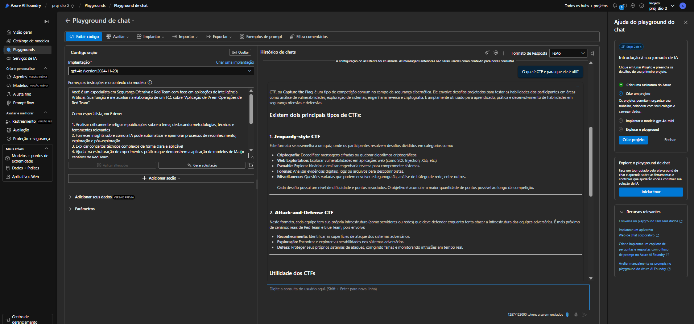

# Chatbot para Red Team com Azure AI Foundry

## Introdução

Este projeto foi desenvolvido como parte do desafio proposto pela DIO para criar um chatbot interativo baseado em conteúdo de PDFs. A solução utiliza o Azure AI Foundry com modelos de IA (GPT-4o e Text Embedding) para analisar e responder perguntas relacionadas a documentos técnicos na área de Segurança Ofensiva, especificamente focado em operações de Red Team.

O sistema permite carregar artigos científicos e documentos técnicos sobre segurança ofensiva, processar seu conteúdo, e criar uma base de conhecimento vetorizada que serve como fonte para respostas contextualizadas sobre técnicas, ferramentas e metodologias de Red Team.

## Objetivo

Este projeto teve como objetivo criar um assistente especializado em Segurança Ofensiva e Red Team que pudesse:

- Processar e analisar documentos técnicos da área
- Responder perguntas específicas sobre técnicas de Red Team
- Fornecer insights sobre a aplicação de IA em operações de segurança ofensiva
- Servir como ferramenta de consulta para profissionais e estudantes de segurança

## Infraestrutura e Recursos Utilizados

- **Azure AI Foundry**: Plataforma para desenvolvimento de soluções de IA
- **Playground de Chat**: Ambiente para configuração e teste do chatbot
- **Azure AI Search**: Serviço de busca cognitiva para indexação dos documentos
- **Modelos de IA**:
  - GPT-4o: Para geração de respostas
  - Text Embedding-3-large: Para vetorização do conteúdo
- **Conta Azure para Estudantes**: Fornece acesso gratuito aos serviços do Azure com algumas limitações

## Arquitetura da Solução

A arquitetura implementada consiste em:

1. **Hub de IA do Azure**: Ambiente centralizado para gerenciar recursos de IA
2. **Serviço de Pesquisa AI**: Responsável pela indexação e busca semântica nos documentos
3. **Modelos de Linguagem e Embedding**: Implementação dos modelos GPT-4o e Text-embedding-3-large
4. **Playground de Chat**: Interface para testar e interagir com o assistente
5. **Armazenamento de dados**: Para documentos PDF e metadados

## Passo a Passo da Implementação

### 1. Criação do Hub de IA no Azure

O primeiro passo foi criar um Hub de IA no Azure para centralizar todos os recursos necessários para o projeto.


Configurações realizadas:
- **Assinatura**: Azure para Estudantes
- **Grupo de recursos**: dio-lab-2
- **Região**: East US 2
- **Nome**: dio-proj-2


### 2. Configuração da Rede e Segurança

Configuramos os aspectos de segurança, identidade e rede do Hub de IA:


### 3. Configuração do Armazenamento

Configuramos o armazenamento para os documentos e outros recursos:


### 4. Implantação dos Modelos de IA

#### 4.1 Modelo GPT-4o

Implantamos o modelo GPT-4o para geração de respostas:


A implantação foi configurada com:
- Tipo: Global Standard
- Versão: 2024-11-20
- Limite de tokens: 50K por minuto
- Filtro de conteúdo: DefaultV2


#### 4.2 Modelo de Embedding

Implantamos o modelo text-embedding-3-large para vetorização do conteúdo:


### 5. Criação do Serviço de Pesquisa

Criamos um serviço de pesquisa para indexar os documentos:


### 6. Configuração do Playground de Chat

Configuramos o ambiente de playground para teste do chatbot:


### 7. Definição do Prompt do Sistema

Desenvolvemos um prompt especializado para orientar o comportamento do assistente:

```
Você é um especialista em Segurança Ofensiva e Red Team com foco em aplicações de Inteligência Artificial. Sua função é me auxiliar na elaboração de um TCC sobre "Aplicação de IA em Operações de Red Team".

Como especialista, você deve:

1. Analisar criticamente artigos e publicações sobre o tema, destacando metodologias, técnicas e ferramentas relevantes
2. Fornecer insights sobre como a IA pode automatizar e aprimorar processos de reconhecimento, exploração e pós-exploração
3. Explicar conceitos técnicos complexos de forma clara e aplicável
4. Ajudar na estruturação de experimentos práticos que demonstrem a aplicação de modelos de IA em cenários de Red Team
5. Sugerir abordagens éticas e responsáveis para o uso de IA em segurança ofensiva
6. Identificar limitações e desafios atuais no uso de IA para Red Team

Ao responder minhas dúvidas, utilize uma abordagem técnica e prática, com exemplos concretos sempre que possível. Inclua referências a ferramentas, frameworks e técnicas específicas do setor de segurança ofensiva.

Considere sempre o contexto acadêmico do trabalho, mas com foco na aplicabilidade prática das soluções propostas.
```

### 8. Carregamento e Indexação de Documentos

Carregamos diversos documentos técnicos relacionados a Red Team e segurança ofensiva:


Entre os documentos carregados estavam:
- Radar_Magazine_NTT_DATA_Março_2024_POR.pdf
- cibersegurança-inteligência-artificial-e-novas-tecnologias.pdf
- Crosby-operacionalização-da-inteligência-artificial-para-segurança.pdf
- Dissertação_José_Augusto_de_Almeida_Junior_2_2.pdf
- Artigos sobre frameworks AutoRedTeamer e RedAgent

- 2501.07238v1.pdf  - ciberseguranca-inteligencia-artificial-e-novas-tecnologias-na-area-de-defesa.pdf
- 2503.15754v1.pdf  - Crosby-operacionalizacao-da-inteligencia-artificial-para-a-guerra-algoritmica-POR-Q1-2021.pdf
- 2503.19626v1.pdf  - Dissertacao___Jose_Augusto_de_Almeida_Junior__2_-2.pdf
- 3674845.pdf
- Radar_Magazine__NTT_DATA_Marco_2024_POR.pdf

### 9. Configuração do Índice Vetorial

Configuramos o índice vetorial para realizar buscas semânticas nos documentos:


### 10. Testes e Validação

Realizamos testes iniciais para verificar a qualidade das respostas do chatbot sobre temas relacionados a Red Team:




## Gerenciamento do Projeto

Para gerenciar o projeto, utilizamos as ferramentas de administração do Azure:


## Análise e Resultados

### Capacidades Demonstradas

O chatbot demonstrou eficácia em:

1. **Compreensão contextual**: Entendeu e explicou conceitos específicos de segurança ofensiva
2. **Integração de conhecimento**: Combinou informações de diferentes documentos para respostas mais completas
3. **Citação de fontes**: Referenciou corretamente os documentos utilizados
4. **Explicação técnica**: Traduziu conceitos complexos em explanações claras e acessíveis

### Desafios Encontrados

1. **Limitações da conta para Estudantes**: A conta Azure para Estudantes oferece recursos limitados, o que impediu a publicação do experimento como uma aplicação web. No entanto, foi suficiente para demonstrar o conceito e funcionalidades principais.

2. **Processamento de documentos técnicos**: Alguns documentos mais técnicos e com formatação complexa exigiram ajustes no processamento para melhor extração de informações.

3. **Refinamento de prompts**: Foi necessário iterar várias vezes para encontrar o prompt ideal que direcionasse o modelo para o foco desejado em segurança ofensiva.

4. **Limitações de tokens**: O balanceamento entre a profundidade das respostas e o limite de tokens disponíveis na conta de estudante exigiu otimizações.

## Frameworks e Técnicas de Red Team com IA

O assistente foi capaz de discutir vários frameworks modernos que integram IA em operações de Red Team:

### AutoRedTeamer
Framework multi-agente para red teaming automatizado que opera em duas fases:
1. Agente de proposição de estratégia que descobre e implementa novos vetores de ataque
2. Agente de red teaming que orquestra avaliação automatizada

### RedAgent
Framework que emprega métodos baseados em agentes para conduzir avaliações e descobrir estratégias em operações de Red Team.

### Outros Frameworks Relevantes
- ALI-Agent: Agentes LLM para red teaming com capacidades específicas
- WildTeaming: Foco em descoberta automatizada de estratégias de ataque

## Guia de Implementação do Projeto

Para replicar este projeto, siga os passos abaixo:

1. **Crie uma conta no Azure**
   - Recomendo utilizar o programa Azure para Estudantes se você for elegível

2. **Configure o Hub de IA do Azure**
   - Acesse o portal Azure e crie um novo recurso de Hub de IA
   - Configure as opções básicas, rede e segurança

3. **Implante os modelos necessários**
   - GPT-4o para geração de respostas
   - text-embedding-3-large para vetorização

4. **Crie um serviço de Pesquisa AI**
   - Configure-o para indexar documentos PDF

5. **Prepare seus documentos**
   - Colete artigos, papers e documentação técnica sobre Red Team e segurança ofensiva

6. **Configure o Playground de Chat**
   - Defina o prompt de sistema especializado
   - Conecte aos dados vetorizados

7. **Carregue seus documentos**
   - Faça upload dos PDFs para o índice de pesquisa

8. **Teste e refine**
   - Faça perguntas para validar o funcionamento
   - Ajuste o prompt e parâmetros conforme necessário

## Conclusão

O projeto demonstrou que é possível criar um assistente especializado em segurança ofensiva utilizando o Azure AI Foundry e modelos de linguagem avançados. A combinação do GPT-4o com técnicas de busca vetorial permitiu a criação de um chatbot capaz de analisar e responder consultas baseadas em documentação técnica específica de Red Team.

A experiência de utilizar o Azure AI Foundry foi extremamente valiosa, proporcionando uma visão ampla das possibilidades da plataforma para desenvolvimento de soluções de IA. Mesmo com as limitações da conta para estudantes, foi possível implementar um sistema funcional que demonstra o potencial da tecnologia para aplicações em segurança da informação.

Esta implementação serve como uma prova de conceito que pode ser expandida para um sistema mais robusto com capacidades adicionais, como integração com ferramentas de Red Team existentes ou automação de análises de segurança.

## Próximos Passos

1. **Expansão da base de conhecimento**: Adicionar mais documentos técnicos e artigos científicos
2. **Refinamento do modelo**: Ajustar parâmetros para melhorar a precisão das respostas
3. **Implementação de interfaces programáticas**: Desenvolver APIs para integração com outras ferramentas
4. **Automação de tarefas de Red Team**: Explorar a possibilidade de integrar o assistente com ferramentas de automação

## Referências


1. Dio BootCampo - DP 100 - [https://www.dio.me/bootcamp/microsoft-certification-challenge-dp-100](https://www.dio.me/bootcamp/microsoft-certification-challenge-dp-100)
2. Microsoft Azure AI Foundry - [https://azure.microsoft.com/pt-br/products/ai-studio](https://azure.microsoft.com/pt-br/products/ai-studio)
3. Azure AI Search - [https://azure.microsoft.com/pt-br/products/search](https://azure.microsoft.com/pt-br/products/search)
4. Documentação do Azure OpenAI - [https://docs.microsoft.com/pt-br/azure/cognitive-services/openai](https://docs.microsoft.com/pt-br/azure/cognitive-services/openai)
5. LangChain - Framework para desenvolvimento de aplicações com LLMs - [https://www.langchain.com/](https://www.langchain.com/)
6. Azure para Estudantes - [https://azure.microsoft.com/pt-br/free/students/](https://azure.microsoft.com/pt-br/free/students/)

